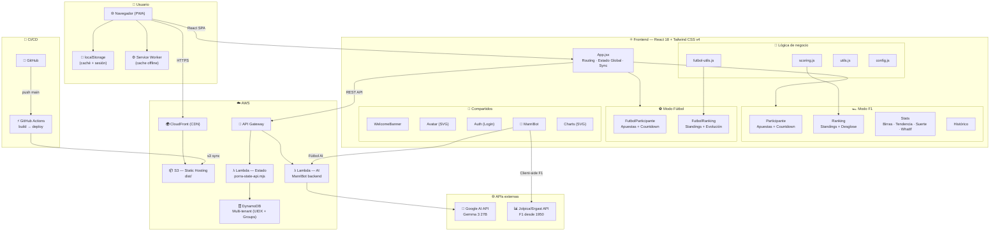
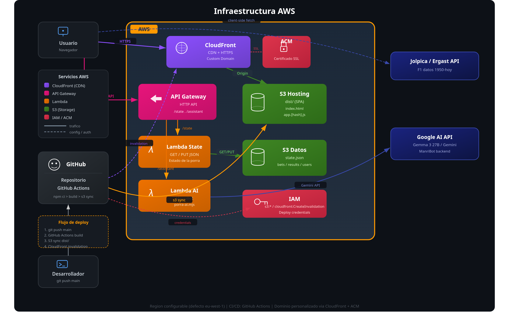

# Porra Birreros — F1 y Futbol 🍺

Aplicacion web para gestionar porras de Formula 1 y Futbol entre amigos. El que pierde, pone las birras.

## 🏗️ Arquitectura de la aplicacion



> Diagrama editable en detalle: abrir [`architecture.drawio.xml`](./architecture.drawio.xml) en [draw.io](https://app.diagrams.net/).

### Infraestructura AWS



> **Flujo**: El usuario accede via CloudFront (CDN + HTTPS). La SPA se carga desde S3 Hosting. Las llamadas a `/state` y `/assistant` van a API Gateway -> Lambda. GitHub Actions despliega automaticamente en cada push a `main`.

### Estructura de archivos

```
src/
├── index.jsx              Punto de entrada React
├── config.js              Configuracion generica (plantilla para forks)
├── config.local.js        ⛔ Configuracion real (gitignored)
├── api.js                 Comunicacion con backend (auth, fetch/save estado remoto)
├── admin-roles.js         Helpers para roles de admin granulares
├── scoring.js             Logica de puntuacion F1 (scoreForRace, standings, stats)
├── futbol-utils.js        Logica de puntuacion futbol (scoreFutbolJornada, standings)
├── utils.js               Utilidades (hash, fechas, sesion, export CSV/PDF, share)
├── f1-data.js             NLP + datos historicos F1 (Jolpica/Ergast API)
├── toast.jsx              Sistema de notificaciones toast
├── i18n.jsx               Contexto de idioma (es/en)
└── components/
    ├── App.jsx             Componente raiz (routing, estado global, sync)
    ├── Auth.jsx            Login, cambio de contrasena, cambio de avatar
    ├── WelcomeBanner.jsx   Mini-dashboard personal al entrar
    ├── Participante.jsx    Vista de apuestas F1 (con countdown y reminder)
    ├── BetForm.jsx         Formulario de apuesta F1
    ├── FutbolParticipante.jsx  Vista de apuestas futbol
    ├── FutbolBetForm.jsx   Formulario de apuesta futbol
    ├── Ranking.jsx         Ranking F1 + desglose + resumen post-carrera
    ├── FutbolRanking.jsx   Ranking futbol + grafico evolucion
    ├── Stats.jsx           Estadisticas, birras, tendencia, suerte, simulador
    ├── Charts.jsx          Grafico de evolucion de posiciones F1
    ├── AdminPanel.jsx      Panel admin unificado (tabs General/F1/Futbol)
    ├── UserManagement.jsx  Gestion de usuarios y grupos
    ├── Admin.jsx           Panel admin F1
    ├── FutbolAdmin.jsx     Panel admin futbol
    ├── CreateGroup.jsx     Formulario creacion de grupo
    ├── JoinGroup.jsx       Formulario para unirse a grupo
    ├── Rules.jsx           Normas F1 y futbol
    ├── Historico.jsx       Historico de temporadas anteriores
    ├── AIAssistant.jsx     Asistente AI (chat F1/futbol)
    ├── Avatar.jsx          Avatares SVG con fallback por modo
    └── CircuitCard.jsx     Tarjeta de circuito con trazado SVG

assets/
├── avatars/               Caricaturas SVG (gitignored, excepto default.svg)
├── circuit_tracks/        24 trazados de circuitos SVG
├── calendar_YYYY.json     Calendario F1 de la temporada
├── drivers_YYYY.json      Pilotos F1 de la temporada
├── teams_YYYY.json        Escuderias F1 de la temporada
├── circuits_YYYY.json     Info de circuitos
└── historical_YYYY.json   Resultados historicos

.env                       ⛔ URLs de backend (gitignored)
.env.example               Plantilla de variables de entorno
porra-ai.mjs               Lambda AWS (AI backend)
build.mjs                  Script de build (esbuild + Tailwind CLI)
```

### Stack tecnologico

| Capa | Tecnologia |
|------|-----------|
| **Frontend** | React 18, Tailwind CSS v4, glassmorphism UI |
| **Build** | esbuild (bundle + minify), @tailwindcss/cli |
| **Backend** | AWS Lambda (Node.js), API Gateway |
| **AI** | Google AI API (Gemma / Gemini), client-side Jolpica/Ergast |
| **Storage** | AWS DynamoDB (multi-tenant) + localStorage (cache local) |
| **Hosting** | S3 + CloudFront (CDN) |
| **CI/CD** | GitHub Actions (build + deploy en push a main) |

## 📋 Caracteristicas

### Porra F1
- Apuestas por pole, podio y 3 preguntas adicionales (autor rotativo)
- Ranking global con desempates: puntos -> victorias GP -> podios exactos -> aciertos -> menos penalizaciones -> apuesta mas temprana
- Apuesta ciega: no ves las apuestas de otros hasta despues de la quali
- Countdown en tiempo real con indicador de urgencia
- Resultado del ano anterior y puntos del usuario en cada circuito
- 24 circuitos SVG con trazados realistas
- Compartir apuesta por WhatsApp (incluye preguntas)

### Porra Futbol
- N partidos por jornada (configurable)
- Puntuacion: 3 pts exacto, 1 pt signo correcto, 0 pts fallo, -1 catastrofica
- Desempates: puntos -> victorias -> exactos -> signos -> menos penalizaciones -> menor diferencia de goles -> apuesta mas temprana
- Apuesta ciega hasta despues del cierre

### Penalizaciones (ambos modos)
- No apostar: **-3 pts**
- Apuesta fuera de plazo: **-2 pts**
- Apuesta catastrofica (futbol, 0 aciertos): **-1 pt**

### Estadisticas y analisis
- **Historico de birras**: quien ha pagado mas rondas por GP/jornada
- **Tendencia de puntos**: grafico SVG de barras agrupadas por carrera
- **Indice de suerte**: tasa de aciertos, eficiencia, consistencia, plenos
- **Simulador "Que habria pasado si..."**: modifica resultados y recalcula ranking
- **Resumen post-carrera**: ganador, perdedor, aciertos de pole, plenos
- **Grafico de evolucion**: posiciones por carrera/jornada

### Multi-tenancy
- **Login global**: un usuario se autentica una vez y accede a todos sus grupos
- **Selector de grupo**: si perteneces a varios grupos, puedes cambiar desde el header
- **Admin granular**: roles independientes para general (usuarios), F1 y futbol
- **Gestion de grupos**: desde el panel de admin puedes ver/añadir/quitar usuarios de grupos
- **Aislamiento de datos**: cada grupo tiene sus propios usuarios, apuestas y resultados

### Calidad de vida
- **Mini-dashboard**: posicion, tendencia, estado de apuesta al entrar
- **Banner recordatorio**: alerta si faltan menos de 24h y no has apostado
- **Asistente AI**: datos F1 historicos (1950-hoy) + futbol
- **Exportar**: CSV y PDF de rankings
- **PWA**: instalable como app, Service Worker con cache
- **Avatares**: caricaturas SVG personalizadas por participante y modo
- **Multidioma**: soporte es/en

## 🔧 Configuracion

El repositorio es completamente agnostico: no contiene datos personales, URLs de produccion ni credenciales. Toda la configuracion especifica de cada instancia vive en ficheros locales que estan en `.gitignore`.

### Que va en git (publico)

| Fichero | Contenido |
|---------|-----------|
| `src/config.js` | Configuracion generica con valores placeholder (`Jugador1`, `Jugador2`...) |
| `.env.example` | Plantilla de variables de entorno con URLs de ejemplo |
| `assets/avatars/default.svg` | Avatar por defecto |
| Todo el codigo fuente | Sin datos personales, URLs ni credenciales |

### Que es local (gitignored)

| Fichero | Contenido |
|---------|-----------|
| `src/config.local.js` | Participantes reales, hashes de contrasenas, colores, equipos |
| `.env` | URLs reales (dominio, API Gateway, Lambda AI) |
| `assets/avatars/*.svg` | Caricaturas SVG personalizadas (excepto default.svg) |

### Como funciona el build

1. `build.mjs` detecta si existe `src/config.local.js`
2. Si existe, un plugin de esbuild redirige todos los `import` de `config.js` a `config.local.js` de forma transparente
3. Si no existe, usa `config.js` con los valores placeholder
4. `build.mjs` lee `.env` e inyecta las URLs en el HTML de produccion (CSP, og:url, preconnect, `window.PORRA_API_BASE`, `window.PORRA_AI_URL`)

### Datos en runtime

Los datos reales de la aplicacion (participantes, apuestas, resultados, usuarios con passwords hasheados) se almacenan en **DynamoDB** y se sincronizan con el frontend via API Gateway + Lambda. El `config.local.js` solo define la configuracion inicial de seed (nombres, hashes de password por defecto, colores).

### API endpoints

El backend (`porra-state-api.mjs`) expone rutas granulares con validacion server-side:

#### Autenticacion y grupos

| Metodo | Ruta | Descripcion | Permisos |
|--------|------|-------------|----------|
| `POST` | `/auth/login` | Login global (devuelve grupos del usuario) | Todos |
| `POST` | `/auth/verify` | Verificar contrasena actual (server-side) | Todos |
| `GET` | `/users/{name}/groups` | Grupos de un usuario | Propio o admin |
| `GET` | `/groups/list` | Lista de todos los grupos | Solo admin |
| `POST` | `/groups` | Crear nuevo grupo | Todos |
| `POST` | `/groups/{groupId}/join` | Unirse a un grupo (requiere inviteCode) | Todos |
| `GET` | `/invite/{code}` | Validar codigo de invitacion | Todos |

#### Rutas multi-tenant (prefijo `/g/{groupId}/`)

| Metodo | Ruta | Descripcion | Permisos |
|--------|------|-------------|----------|
| `GET` | `/g/{gid}/state` | Estado completo del grupo | Todos |
| `PUT` | `/g/{gid}/bets/f1/{raceKey}` | Guardar apuesta F1 | Solo propietario |
| `PUT` | `/g/{gid}/bets/futbol/{jornadaId}` | Guardar apuesta futbol | Solo propietario |
| `PUT` | `/g/{gid}/results/f1/{raceKey}` | Guardar resultado F1 | Solo admin |
| `PUT` | `/g/{gid}/results/futbol/{jornadaId}` | Guardar resultado futbol | Solo admin |
| `PUT` | `/g/{gid}/users/{name}` | Modificar perfil usuario | Propio o admin |
| `POST` | `/g/{gid}/users` | Crear usuario en grupo | Solo admin |
| `DELETE` | `/g/{gid}/users/{name}` | Eliminar usuario de grupo | Solo admin |
| `PUT` | `/g/{gid}/meta` | Configuracion general | Solo admin |
| `PUT` | `/g/{gid}/admin/f1/{raceKey}` | Operaciones admin F1 | Solo admin |
| `PUT` | `/g/{gid}/admin/futbol/{jornadaId}` | Operaciones admin futbol | Solo admin |

Cada peticion incluye `x-porra-user` para identificar al usuario. Las operaciones de escritura validan permisos en el servidor.

### Esquema DynamoDB

Tabla unica con clave compuesta (`pk`, `sk`). Diseño multi-tenant con prefijo `G#{groupId}`:

#### Indice de usuarios (lookup global)

| pk | sk | Contenido |
|----|-----|-----------|
| `UIDX#nombre_lower` | `G#groupId` | groupId, groupName, joinedAt, username |
| `GROUPS` | `G#groupId` | name, inviteCode, sports, memberCount |
| `INVITE#code` | `META` | groupId, groupName |

#### Datos por grupo (pk = `G#{groupId}`, sk = `{entidad}\|{sub}`)

| sk (dentro del grupo) | Contenido |
|------------------------|-----------|
| `META\|CONFIG` | drivers, teams, championships, basePoints |
| `META\|AVATARS` | avatares base64 por usuario |
| `META\|QUESTIONS` | preguntas F1 por carrera |
| `USER#nombre\|PROFILE` | passwordHash, isAdmin, adminRoles, blocked, porras |
| `F1#raceKey\|RESULT` | pole, podium |
| `F1#raceKey\|BET#nombre` | apuesta: pole, podium, q, submittedAt |
| `F1#raceKey\|WINDOW` | forceClosed, forceOpen |
| `FUT#jornadaId\|CONFIG` | partidos, deadline |
| `FUT#jornadaId\|RESULT` | resultados por partido |
| `FUT#jornadaId\|BET#nombre` | predicciones, submittedAt |

## 🚀 Como usar este proyecto (Fork)

### 1. Haz fork y clona

```bash
git clone https://github.com/TU_USUARIO/porra-birreros-f1.git
cd porra-birreros-f1
npm install
```

### 2. Configura tus participantes

Copia la plantilla de configuracion y personaliza:

```bash
cp src/config.js src/config.local.js
```

Edita `src/config.local.js` con los datos de tu grupo:

```javascript
export const CONFIG = {
  participants: ["Ana", "Luis", "Marta", "Pedro", "Sara"],
  timezone: "Europe/Madrid",
  sessionTimeoutMs: 30 * 60 * 1000,
  questionAuthorsOrder: ["Ana", "Luis", "Marta", "Pedro", "Sara"],
  futbolTeams: ["Real Madrid", "FC Barcelona", "Atletico", "Sevilla"],
  futbolDeadlineHour: "15:00",
};

// Genera hashes con: echo -n "TuPassword" | sha256sum
export const DEFAULT_PASSWORD_HASH = "tu-hash-sha256-aqui";
export const ADMIN_SECRET_HASH = "tu-hash-admin-aqui";

// Colores para graficos (uno por participante)
export const PILOT_COLORS = {
  "Ana": "#c4544e", "Luis": "#5a9abf", "Marta": "#5fb8a8",
  "Pedro": "#c9874a", "Sara": "#9078b0",
};
```

> Este fichero esta en `.gitignore` y nunca se sube al repositorio. Al hacer build, esbuild lo usa automaticamente si existe.

### 3. Configura las URLs de tu backend

```bash
cp .env.example .env
```

Edita `.env` con tus URLs reales:

```env
PORRA_API_BASE=https://tu-api.example.com
PORRA_AI_URL=https://tu-lambda-ai.execute-api.eu-west-1.amazonaws.com
PORRA_DOMAIN=https://tu-dominio.com
```

| Variable | Descripcion | Donde se usa |
|----------|-------------|--------------|
| `PORRA_API_BASE` | URL de tu API Gateway (Lambda State) | `window.PORRA_API_BASE` en el HTML, CSP `connect-src` |
| `PORRA_AI_URL` | URL del endpoint de AI (Lambda ManriBot) | `window.PORRA_AI_URL` en el HTML, CSP `connect-src` |
| `PORRA_DOMAIN` | Tu dominio de produccion | `og:url`, `preconnect` |

> Este fichero esta en `.gitignore`. `build.mjs` lee estas variables e inyecta las URLs en el HTML de produccion.

### 4. Personaliza los avatares (opcional)

Crea SVGs en `assets/avatars/` con las caricaturas de tus participantes:

| Fichero | Uso |
|---------|-----|
| `nombre.svg` | Avatar para modo F1 |
| `nombre-futbol.svg` | Avatar para modo futbol |
| `default.svg` | Fallback (ya incluido en el repo) |

Los nombres de fichero deben coincidir (en minusculas, sin espacios) con los de `CONFIG.participants`.

> Los avatares personales estan en `.gitignore`. Solo `default.svg` va al repositorio.

### 5. Configura el backend AWS

Ver [DEPLOY.md](DEPLOY.md) para instrucciones detalladas.

| Recurso AWS | Funcion |
|-------------|---------|
| **S3 Hosting** | Bucket para servir `dist/` (SPA estatica) |
| **DynamoDB** | Tabla multi-tenant: UIDX (indice usuarios), GROUPS, datos por grupo |
| **API Gateway + Lambda State** | `porra-state-api.mjs` — API REST con rutas granulares |
| **API Gateway + Lambda AI** | `porra-ai.mjs` — ManriBot (opcional) |
| **CloudFront + ACM** | CDN + HTTPS + dominio personalizado |

Variables de entorno de la Lambda State (`porra-state-api.mjs`):

| Variable | Descripcion |
|----------|-------------|
| `TABLE_NAME` | Nombre de la tabla DynamoDB (default: `PorraBirreros`) |
| `ALLOWED_ORIGIN` | Tu dominio para CORS |
| `API_SECRET` | (opcional) Secret compartido con el frontend |

Variables de entorno de la Lambda AI (`porra-ai.mjs`):

| Variable | Descripcion |
|----------|-------------|
| `GEMINI_API_KEY` | API key de Google AI Studio (gratis en [aistudio.google.com](https://aistudio.google.com)) |
| `ALLOWED_ORIGIN` | Tu dominio de produccion para CORS |

#### Crear tabla DynamoDB

```bash
aws dynamodb create-table \
  --table-name PorraBirreros \
  --attribute-definitions \
    AttributeName=pk,AttributeType=S \
    AttributeName=sk,AttributeType=S \
  --key-schema \
    AttributeName=pk,KeyType=HASH \
    AttributeName=sk,KeyType=RANGE \
  --billing-mode PAY_PER_REQUEST
```

#### Migrar datos de S3 a DynamoDB

Si ya tienes datos en S3 (`state.json`), usa el script de migracion:

```bash
PORRA_API_BASE=https://tu-api-antigua.com \
NEW_API_BASE=https://tu-api-nueva.com \
node scripts/migrate-s3-to-dynamodb.mjs
```

### 6. Configura CI/CD (GitHub Actions)

Anade estos secrets en tu repositorio (`Settings > Secrets > Actions`):

| Secret | Descripcion |
|--------|-------------|
| `AWS_ACCESS_KEY_ID` | Access Key de un usuario IAM con permisos S3 |
| `AWS_SECRET_ACCESS_KEY` | Secret Key del mismo usuario |
| `S3_BUCKET_NAME` | Nombre de tu bucket S3 de hosting |
| `AWS_REGION` | Region AWS (ej: `eu-west-1`) |
| `CLOUDFRONT_DISTRIBUTION_ID` | *(opcional)* ID de distribucion CloudFront |

El workflow (`.github/workflows/deploy-s3.yml`) se activa en cada push a `main`:

```
npm ci → npm audit → node build.mjs → aws s3 sync → cloudfront invalidation
```

### 7. Build y previsualizacion local

```bash
node build.mjs        # Compila JS + CSS -> dist/
npx serve dist        # Previsualizar en http://localhost:3000
```

Si todo esta bien configurado, veras en la salida del build:

```
📌 Usando src/config.local.js (configuración local)
```

Si no has creado `config.local.js`, veras:

```
⚠️  No se encontró src/config.local.js — usando config.js genérico
```

### 8. Despliegue

```bash
# Manual
aws s3 sync dist/ s3://TU-BUCKET --delete
aws cloudfront create-invalidation --distribution-id TU_DIST_ID --paths "/*"

# Automatico: haz push a main y GitHub Actions se encarga
git push origin main
```

## 🔐 Seguridad

- **Sanitizacion de estado**: `passwordHash` y `adminSecretHash` nunca se envian al cliente (eliminados en `sanitizeState()`)
- **Validacion server-side**: cada operacion de escritura valida permisos en la Lambda (DynamoDB)
- **Separacion de datos**: un usuario no puede modificar apuestas de otro (validado en backend)
- **Admin-only**: resultados, configuracion, gestion de usuarios, PUT /state y endpoints de migracion solo accesibles para admin
- **Verificacion de contrasena server-side**: `POST /auth/verify` permite validar la contrasena actual sin exponer hashes al frontend
- **Invite code obligatorio**: unirse a un grupo requiere el codigo de invitacion correcto
- **Validacion de IDs**: `groupId` validado con `isValidId()` (`[a-zA-Z0-9_-]{1,50}`) para prevenir inyeccion en claves DynamoDB
- **Proteccion de endpoints de enumeracion**: `GET /users/{name}/groups` requiere ser el propio usuario o admin; `GET /groups/list` requiere admin
- **localStorage limpio**: no se almacenan `passwordHash` ni `adminSecretHash` en la cache local del navegador
- **Error 500 opaco**: las respuestas de error no exponen detalles internos (`err.message`)
- Contrasenas hasheadas con SHA-256 (nunca se almacenan en texto plano)
- Sesiones con token aleatorio en sessionStorage (expiran tras 30 min)
- Rate limiting en login: 5 intentos client-side (cooldown 30s) + 10 req/min/IP server-side en `/auth/login`, `/auth/verify`, `/groups` y `/groups/{gid}/join`
- Mensajes de error genericos en login (no revelan si el usuario existe)
- Panel admin protegido con secreto independiente
- CSP (Content Security Policy) generado dinamicamente segun `.env`
- Lambda AI con rate limiting (10 req/min/IP) y proteccion contra prompt injection
- `queryByPk` con paginacion completa y `BatchWriteCommand` con reintentos para `UnprocessedItems`
- `exportPDF` con escape HTML para prevenir XSS
- Datos personales (participantes, hashes, URLs) fuera del repositorio

## 📝 Notas

- El modo seleccionado (F1/Futbol) se guarda en localStorage
- Los datos se sincronizan automaticamente con el backend remoto (S3 via Lambda)
- Si no hay resultados publicados, no se asigna quien paga las birras
- Datos de F1 historicos (1950-hoy) disponibles via Jolpica/Ergast API (client-side, sin coste)
- La app funciona offline gracias al Service Worker (PWA)
- Al hacer fork, el repositorio no contiene datos personales: necesitas crear `config.local.js` y `.env`
