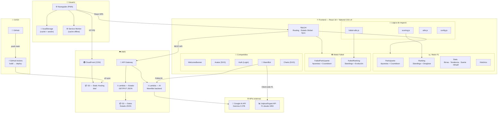

# Porra Birreros — F1 y Fútbol 🍺

Aplicación web para gestionar porras de Fórmula 1 y Fútbol entre amigos. El que pierde, pone las birras.

## 🏗️ Arquitectura



> Diagrama editable en detalle: abrir [`architecture.drawio.xml`](./architecture.drawio.xml) en [draw.io](https://app.diagrams.net/).

### Estructura de archivos

```
src/
├── index.jsx              Punto de entrada React
├── config.js              Constantes (participantes, timezone, equipos, colores)
├── api.js                 Comunicación con backend (fetch/save estado remoto)
├── scoring.js             Lógica de puntuación F1 (scoreForRace, standings, stats)
├── futbol-utils.js        Lógica de puntuación fútbol (scoreFutbolJornada, standings)
├── utils.js               Utilidades (hash, fechas, sesión, export CSV/PDF, share)
├── f1-data.js             NLP + datos históricos F1 (Jolpica/Ergast API)
├── toast.jsx              Sistema de notificaciones toast
├── i18n.jsx               Contexto de idioma (es/en)
└── components/
    ├── App.jsx             Componente raíz (routing, estado global, sync)
    ├── Auth.jsx            Login, cambio de contraseña, cambio de avatar
    ├── WelcomeBanner.jsx   Mini-dashboard personal al entrar
    ├── Participante.jsx    Vista de apuestas F1 (con countdown y reminder)
    ├── BetForm.jsx         Formulario de apuesta F1
    ├── FutbolParticipante.jsx  Vista de apuestas fútbol
    ├── FutbolBetForm.jsx   Formulario de apuesta fútbol
    ├── Ranking.jsx         Ranking F1 + desglose + resumen post-carrera
    ├── FutbolRanking.jsx   Ranking fútbol + gráfico evolución
    ├── Stats.jsx           Estadísticas, birras, tendencia, suerte, simulador
    ├── Charts.jsx          Gráfico de evolución de posiciones F1
    ├── Admin.jsx           Panel admin F1
    ├── FutbolAdmin.jsx     Panel admin fútbol
    ├── Rules.jsx           Normas F1 y fútbol
    ├── Historico.jsx       Histórico de temporadas anteriores
    ├── AIAssistant.jsx     Asistente AI (chat F1/fútbol)
    ├── Avatar.jsx          Avatares SVG con fallback por modo
    └── CircuitCard.jsx     Tarjeta de circuito con trazado SVG

assets/
├── avatars/               Caricaturas SVG (F1 + fútbol) + default
├── circuit_tracks/        24 trazados de circuitos SVG
├── calendar_YYYY.json     Calendario F1 de la temporada
├── drivers_YYYY.json      Pilotos F1 de la temporada
├── teams_YYYY.json        Escuderías F1 de la temporada
├── circuits_YYYY.json     Info de circuitos
└── historical_YYYY.json   Resultados históricos

porra-ai.mjs               Lambda AWS (AI backend)
build.mjs                  Script de build (esbuild + Tailwind CLI)
```

### Stack tecnológico

| Capa | Tecnología |
|------|-----------|
| **Frontend** | React 18, Tailwind CSS v4, glassmorphism UI |
| **Build** | esbuild (bundle + minify), @tailwindcss/cli |
| **Backend** | AWS Lambda (Node.js), API Gateway |
| **AI** | Google AI API (Gemma / Gemini), client-side Jolpica/Ergast |
| **Storage** | AWS S3 (estado remoto) + localStorage (caché local) |
| **Hosting** | S3 + CloudFront (CDN) |
| **CI/CD** | GitHub Actions (build + deploy en push a main) |

## 📋 Características

### Porra F1
- Apuestas por pole, podio y 3 preguntas adicionales (autor rotativo)
- Ranking global con desempates: puntos → victorias GP → podios exactos → aciertos → menos penalizaciones → apuesta más temprana
- Apuesta ciega: no ves las apuestas de otros hasta después de la quali
- Countdown en tiempo real con indicador de urgencia
- Resultado del año anterior y puntos del usuario en cada circuito
- 24 circuitos SVG con trazados realistas
- Compartir apuesta por WhatsApp (incluye preguntas)

### Porra Fútbol
- N partidos por jornada (configurable)
- Puntuación: 3 pts exacto, 1 pt signo correcto, 0 pts fallo, -1 catastrófica
- Desempates: puntos → victorias → exactos → signos → menos penalizaciones → menor diferencia de goles → apuesta más temprana
- Apuesta ciega hasta después del cierre

### Penalizaciones (ambos modos)
- No apostar: **-3 pts**
- Apuesta fuera de plazo: **-2 pts**
- Apuesta catastrófica (fútbol, 0 aciertos): **-1 pt**

### Estadísticas y análisis
- **Histórico de birras**: quién ha pagado más rondas por GP/jornada
- **Tendencia de puntos**: gráfico SVG de barras agrupadas por carrera
- **Índice de suerte**: tasa de aciertos, eficiencia, consistencia, plenos
- **Simulador "¿Qué habría pasado si...?"**: modifica resultados y recalcula ranking
- **Resumen post-carrera**: ganador, perdedor, aciertos de pole, plenos
- **Gráfico de evolución**: posiciones por carrera/jornada

### Calidad de vida
- **Mini-dashboard**: posición, tendencia, estado de apuesta al entrar
- **Banner recordatorio**: alerta si faltan <24h y no has apostado
- **Asistente AI**: datos F1 históricos (1950-hoy) + fútbol
- **Exportar**: CSV y PDF de rankings
- **PWA**: instalable como app, Service Worker con cache
- **Avatares**: caricaturas SVG personalizadas por participante y modo
- **Multidioma**: soporte es/en

## 🚀 Cómo usar este proyecto (Fork)

### 1. Haz fork del repositorio

```bash
git clone https://github.com/TU_USUARIO/porra-birreros-f1.git
cd porra-birreros-f1
npm install
```

### 2. Configura los participantes

Edita `src/config.js` y cambia los datos a los de tu grupo:

```javascript
export const CONFIG = {
  participants: ["Jugador1", "Jugador2", "Jugador3", "Jugador4", "Jugador5"],
  timezone: "Europe/Madrid",           // Tu zona horaria
  sessionTimeoutMs: 30 * 60 * 1000,
  questionAuthorsOrder: ["Jugador1", "Jugador2", "Jugador3", "Jugador4", "Jugador5"],
  futbolTeams: ["Equipo1", "Equipo2", "Equipo3", "Equipo4"],
  futbolDeadlineHour: "15:00",
};
```

También en `config.js`, actualiza:
- `DEFAULT_PASSWORD_HASH` — hash SHA-256 de la contraseña inicial que quieras
- `ADMIN_SECRET_HASH` — hash SHA-256 del secreto de administrador
- `PILOT_COLORS` — colores para cada participante en los gráficos

Para generar un hash SHA-256:
```bash
echo -n "TuContraseña" | sha256sum
```

### 3. Personaliza los avatares (opcional)

Reemplaza los SVGs en `assets/avatars/` con las caricaturas de tus participantes:
- `nombre.svg` — avatar para modo F1
- `nombre-futbol.svg` — avatar para modo fútbol
- `default.svg` — avatar por defecto

Los nombres deben coincidir (en minúsculas, sin espacios) con los de `CONFIG.participants`.

### 4. Configura el backend AWS

Necesitas crear los siguientes recursos en AWS:

#### S3 Buckets
- **Hosting**: bucket para servir los archivos estáticos (`dist/`)
- **Datos**: bucket para almacenar el estado JSON de la porra

#### API Gateway + Lambda (Estado)
Una Lambda que haga GET/PUT del JSON de estado desde S3. Configura las variables de entorno correspondientes en `src/api.js`.

#### API Gateway + Lambda (AI — opcional)
Si quieres el asistente AI, despliega `porra-ai.mjs` como Lambda y configura:
- Variable de entorno `GOOGLE_AI_KEY` con tu API key de Google AI Studio
- El endpoint en `src/components/AIAssistant.jsx`

#### CloudFront (recomendado)
Configura una distribución de CloudFront apuntando al bucket de hosting para CDN y HTTPS con tu dominio personalizado.

### 5. Configura CI/CD (GitHub Actions)

Añade estos secrets en tu repositorio (`Settings → Secrets → Actions`):

| Secret | Descripción |
|--------|-------------|
| `AWS_ACCESS_KEY_ID` | Access Key de un usuario IAM con permisos S3 |
| `AWS_SECRET_ACCESS_KEY` | Secret Key del mismo usuario |
| `CLOUDFRONT_DISTRIBUTION_ID` | *(opcional)* ID de tu distribución CloudFront |

Edita `.github/workflows/deploy-s3.yml` y cambia el nombre del bucket S3 al tuyo.

Ver [DEPLOY.md](DEPLOY.md) para permisos IAM detallados.

### 6. Build y previsualización local

```bash
node build.mjs        # Compila JS + CSS → dist/
npx serve dist        # Previsualizar en http://localhost:3000
```

### 7. Despliegue

```bash
# Manual
aws s3 sync dist/ s3://TU-BUCKET --delete
aws cloudfront create-invalidation --distribution-id TU_DIST_ID --paths "/*"

# Automático: haz push a main y GitHub Actions se encarga
git push origin main
```

## 🔐 Seguridad

- Contraseñas hasheadas con SHA-256 (nunca se almacenan en texto plano)
- Sesiones con token aleatorio en sessionStorage (expiran tras 30 min)
- Rate limiting en login (5 intentos, cooldown 30s)
- Panel admin protegido con secreto independiente
- CSP (Content Security Policy) configurado en producción

## 📝 Notas

- El modo seleccionado (F1/Fútbol) se guarda en localStorage
- Los datos se sincronizan automáticamente con el backend remoto
- Si no hay resultados publicados, no se asigna quién paga las birras
- Datos de F1 históricos (1950-hoy) disponibles vía Jolpica/Ergast API (client-side, sin coste)
- La app funciona offline gracias al Service Worker (PWA)
